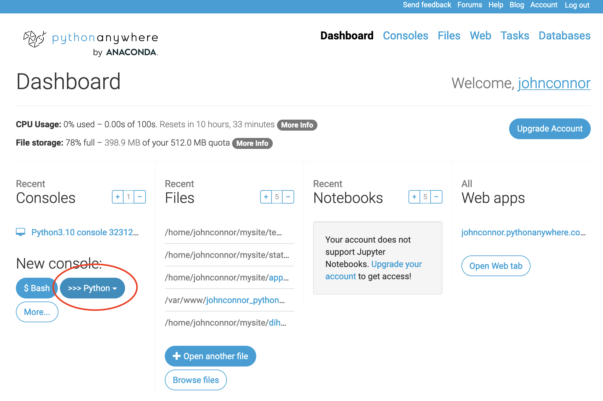

# Introduction

We're going to look at our first dataset today. Specifically, this will be a dataset that undergirds the public display of a specific library's collections.

This will allow us to build a conceptual model of the links between what people see when they explore an archive, and the structured data that has to be put in place to allow them to find what they're looking for.

## Taking a peek at the dataset

Let's look at how the Library of Congress presents its collections in human and machine-readable formats.

1. Public-facing webpages
	1. Open up the [Library of Congress collections portal](https://www.loc.gov/collections/)
		1. What do we see here, structurally and descriptively?
	1. Click through to [a specific collection](https://www.loc.gov/collections/tenth-to-sixteenth-century-liturgical-chants/)
		1. What do we see here?
1. API -- same thing in a different format! Just add ```?fo=json&at=results```
	1. What do we see in [the main collections view](https://www.loc.gov/collections/?fo=json&at=results)? 
	1. What do we see in [the view of the specific collection](https://www.loc.gov/collections/tenth-to-sixteenth-century-liturgical-chants/?fo=json&at=results)? 

## Let's poke at it from the command line

Log into [Python Anywhere](https://www.pythonanywhere.com/).

Open up a terminal. Click the "New console" ```>>> Python 3.10``` button.



On the command line, do the following, one line at a time:

	import requests
	r=requests.get('https://www.loc.gov/collections/?fo=json&at=results')
	r.status_code
	import json
	j=json.loads(r.text)
	print(json.dumps(j,indent=2))
	print(j.keys())

What do we see here?

## Solo Exercise

We'll continue our exercise solo.

### 1. Fork this repository

Create a markdown file with your username (like last round).

### 2. Choose a Collection in LOC

Pick one of the sub-collections, like "10th-16th Century Liturgical Chants"

### 3. Read the following pages:

The [Python Requests](https://requests.readthedocs.io/en/latest/) module

The [Python JSON](https://docs.python.org/3/library/json.html) module 

### 4. Write up your findings

Poke around in your collection, in

1. The JSON format 
1. The normal webpage view
1. The command-line view

What is interesting about these collections and these views? What is difficult / doesn't make sense? How might you want to make use of this data?
